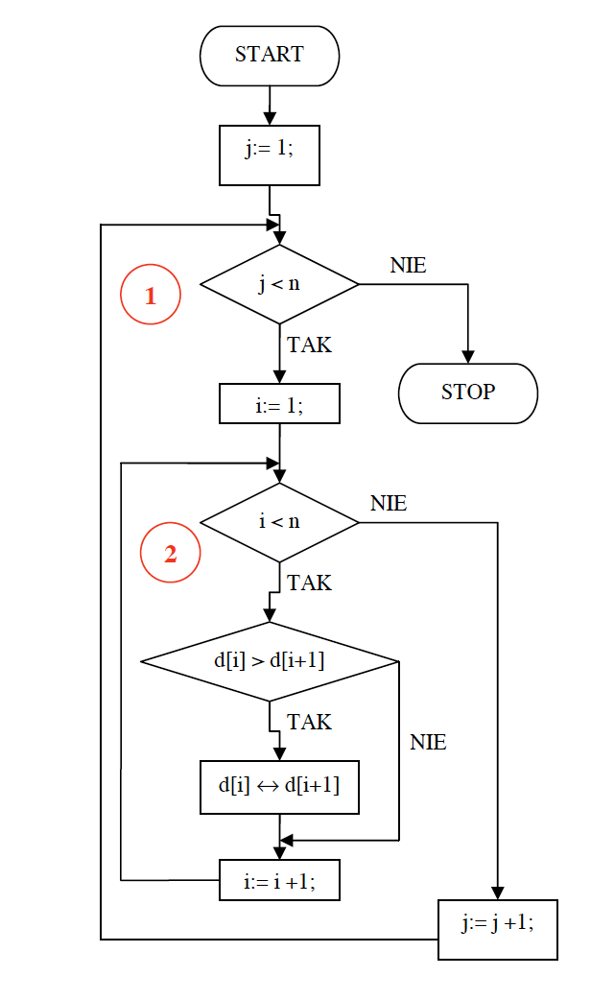

# Sortowanie

## Algorytmy sortowania ciągu liczb: 
1. bąbelkowe, 
2. przez wybór, 
3. przez wstawianie,
4. liniowe lub binarne, 
5. przez scalanie, 
6. szybki, 
7. kubełkowy.


# 1. Sortowanie bąbelkowe
Sortowanie bąbelkowe (ang. bubble sort) to jeden z najprostszych algorytmów sortowania. 
Jego działanie opiera się na porównywaniu sąsiadujących elementów 
i zamianie ich miejscami, jeśli są w złej kolejności. Proces ten jest powtarzany, aż lista będzie posortowana.

Algorytm sortowania bąbelkowego jest jednym z najstarszych algorytmów sortujących. Można go potraktować jako ulepszenie algorytmu sortowania naiwnego.
Zasada działania opiera się na cyklicznym porównywaniu par sąsiadujących elementów i zamianie ich kolejności w przypadku niespełnienia kryterium porządkowego zbioru. Operację tę
wykonujemy dotąd, aż cały zbiór zostanie posortowany. Algorytm sortowania bąbelkowego przy porządkowaniu zbioru nieposortowanego ma klasę czasowej złożoności obliczeniowej równą O(n<sup>2</sup>). 
Sortowanie odbywa się w miejscu.

### Przykład :
Jako przykład działania algorytmu sortowania bąbelkowego posortujemy przy jego pomocy 5-cio elementowy zbiór liczb {5 4 3 2 1}, który wstępnie jest posortowany w kierunku odwrotnym, 
co możemy uznać za przypadek najbardziej niekorzystny, ponieważ wymaga przestawienia wszystkich elementów.

<table>
<thead>
<tr>
<td>Obieg</td><td>Zbiór</td><td>Opis operacji</td>
</tr>
</thead>
<tbody>
<tr>
<td rowspan="5">
1
</td>
<td>
5 4 3 2 1
</td>
<td>
Rozpoczynamy od pierwszej pary, która wymaga wymiany elementów
</td>
</tr>
<tr>
<td>
4 5 3 2 1 
</td>
<td>
Druga para też wymaga zamiany elementów
</td>
</tr>
<tr>
<td>
4 3 5 2 1 
</td>
<td>
Wymagana wymiana elementów
</td>
</tr>
<tr>
<td>
4 3 2 5 1 
</td>
<td>
Ostatnia para również wymaga wymiany elementów
</td>
</tr>
<tr>
<td>
4 3 2 1 5
</td>
<td>
Stan po pierwszym obiegu. Zwróć uwagę, iż najstarszy element (5) znalazł się na końcu zbioru, a najmłodszy (1) przesunął się o jedną pozycję w lewo.
</td>
</tr>
<tr>
<td rowspan="5">
2
</td>
<td>
4 3 2 1 5 
</td>
<td>
Para wymaga wymiany
</td>
</tr>
<tr>
<td>
3 4 2 1 5 
</td>
<td>
Para wymaga wymiany
</td>
</tr>
<tr>
<td>
3 2 4 1 5 
</td>
<td>
Para wymaga wymiany
</td>
</tr>
<tr>
<td>
3 2 1 4 5 
</td>
<td>
Elementy są w dobrej kolejności, zamiana 2 nie jest konieczna.
</td>
</tr>
<tr>
<td>
3 2 1 4 5
</td>
<td>
Stan po drugim obiegu. Zwróć uwagę, iż najmniejszy element (1) znów przesunął się o jedną pozycję w lewo. Z obserwacji tych można wywnioskować, iż po każdym obiegu najmniejszy element wędruje o jedną pozycję ku początkowi zbioru. Najstarszy element zajmuje natomiast swe miejsce końcowe.
</td>
</tr>
<tr>
<td rowspan="5">
3
</td>
<td>
3 2 1 4 5
</td>
<td>
Para wymaga wymiany
</td>
</tr>
<tr>
<td>
2 3 1 4 5
</td>
<td>
Para wymaga wymiany
</td>
</tr>
<tr>
<td>
2 1 3 4 5
</td>
<td>
Dobra kolejność
</td>
</tr>
<tr>
<td>
2 1 3 4 5
</td>
<td>
Dobra kolejność
</td>
</tr>
<tr>
<td>
2 1 3 4 5 
</td>
<td>
Stan po trzecim obiegu. Wnioski te same.
</td>
</tr>
<tr>
<td rowspan="5">
4
</td>
<td>
2 1 3 4 5
</td>
<td>
Para wymaga wymiany
</td>
</tr>
<tr>
<td>
1 2 3 4 5
</td>
<td>
Dobra kolejność
</td>
</tr>
<tr>
<td>
1 2 3 4 5
</td>
<td>
Dobra kolejność
</td>
</tr>
<tr>
<td>
1 2 3 4 5
</td>
<td>
Dobra kolejność
</td>
</tr>
<tr>
<td>
1 2 3 4 5 
</td>
<td>
Zbiór jest posortowany. Koniec
</td>
</tr>
</tbody>
</table>

Posortowanie naszego zbioru wymaga 4 obiegów. Jest to oczywiste: w przypadku najbardziej niekorzystnym najmniejszy element znajduje się na samym końcu zbioru wejściowego. Każdy obieg przesuwa go o jedną pozycję w kierunku początku zbioru. 
Takich przesunięć należy wykonać n - 1 (n - ilość elementów w zbiorze). Algorytm sortowania bąbelkowego, w przeciwieństwie do algorytmu sortowania naiwnego, nie przerywa porównywania par elementów po napotkaniu pary nie spełniającej założonego porządku.
Po zamianie kolejności elementów sprawdzana jest kolejna para elementów sortowanego zbioru. Dzięki temu podejściu rośnie efektywność algorytmu oraz zmienia się klasa czasowej złożoności obliczeniowej z O(n<sup>3</sup>) na O(n<sup>2</sup>).


### Schemat blokowy:



### Opis schematu blokowego

Sortowanie wykonywane jest w dwóch zagnieżdżonych pętlach. Pętla zewnętrzna nr 1 kontrolowana jest przez zmienną j. Wykonuje się ona n - 1 razy. Wewnątrz pętli
nr 1 umieszczona jest pętla nr 2 sterowana przez zmienną i. Wykonuje się ona również n - 1 razy. W efekcie algorytm wykonuje w sumie: T1(n) = (n - 1)2 = n2 - 2n + 1
obiegów pętli wewnętrznej, po których zakończeniu zbiór zostanie posortowany. Sortowanie odbywa się wewnątrz pętli nr 2. Kolejno porównywany jest i-ty element z
elementem następnym. Jeśli elementy te są w złej kolejności, to zostają zamienione miejscami. W tym miejscu jest najważniejsza różnica pomiędzy algorytmem sortowania
bąbelkowego a algorytmem sortowania naiwnego. Ten drugi w momencie napotkania elementów o złej kolejności zamienia je miejscami i rozpoczyna cały
proces sortowania od początku. Algorytm sortowania bąbelkowego wymienia miejscami źle ułożone elementy sortowanego zbioru i przechodzi do następnej pary
zwiększając indeks i o 1.

# 2. Sortowanie przez wybór

# 3. Sortowanie przez wstawianie

# 4. Sortowanie liniowe lub binarne 


# 5. Sortowanie przez scalanie

## Wprowadzenie

Sortowanie przez scalanie (ang. merge sort) to jeden z klasycznych algorytmów sortowania, który wykorzystuje paradygmat dziel i zwyciężaj (ang. divide and conquer). 
Algorytm jest znany z tego, że działa z gwarantowaną złożonością czasową O(nlogn), niezależnie od początkowego ułożenia danych. Jest stabilny (zachowuje kolejność 
elementów o równych wartościach) i szczególnie przydatny w sortowaniu dużych zbiorów danych.

## Zasada działania

**Dziel:** 
Dzielimy tablicę wejściową na dwie równe (lub prawie równe) części, aż każda z podtablic będzie miała jeden element.

**Sortuj i scalaj:**
Rekurencyjnie scalaj dwie posortowane podtablice w jedną większą, aż do otrzymania końcowej, posortowanej tablicy.

## Algorytm
Sortowanie przez scalanie można przedstawić w trzech głównych krokach:

1. Jeśli tablica ma mniej niż dwa elementy, jest już posortowana i może być zwrócona.
2. Rekurencyjnie dzielimy tablicę na dwie części, aż każda z nich zawiera pojedyncze elementy.
3. Łączymy posortowane podtablice w jedną posortowaną listę.

## Implementacja w Pythonie
Oto prosty przykład implementacji sortowania przez scalanie:

```commandline
def merge_sort(array):
    if len(array) <= 1:
        return array  # Tablica z jednym lub zerem elementów jest już posortowana.
    
    # Znajdź punkt podziału
    mid = len(array) // 2
    
    # Rekurencyjnie sortuj lewą i prawą połowę
    left_half = merge_sort(array[:mid])
    right_half = merge_sort(array[mid:])
    
    # Scal posortowane połowy
    return merge(left_half, right_half)

def merge(left, right):
    sorted_array = []
    i = j = 0
    
    # Porównuj elementy i dodawaj mniejsze do posortowanej tablicy
    while i < len(left) and j < len(right):
        if left[i] < right[j]:
            sorted_array.append(left[i])
            i += 1
        else:
            sorted_array.append(right[j])
            j += 1
    
    # Dodaj pozostałe elementy z lewej lub prawej tablicy
    sorted_array.extend(left[i:])
    sorted_array.extend(right[j:])
    
    return sorted_array
```

Przykład działania
Załóżmy, że chcemy posortować listę 

`[38,27,43,3,9,82,10]`.

Podział:

Podziel listę na dwie części: 

`[38,27,43]` i `[3,9,82,10]`.

Rekurencyjnie dziel dalej:

`[38,27,43]` → `[38]` i `[27,43]` → `[27]` i `[43]`,

`[3,9,82,10]` → `[3,9]` i `[82,10]` → `[82]` i `[10]`, 

Scalanie:

`[27]`i`[43]`→`[27,43]`,

`[38]`i`[27,43]`→`[27,38,43]`,

`[3]`i`[9]`→`[3,9]`,

`[82]`i`[10]`→`[10,82]`,

`[3,9]`i`[10,82]`→`[3,9,10,82]`,

`[27,38,43]`i`[3,9,10,82]`→`[3,9,10,27,38,43,82]`.

Wynik: 

`[3,9,10,27,38,43,82]`.

# 6. Sortowanie szybki

# 7. Sortowanie kubełkowy

## Zadania
1. Wylosuj 20 liczb z zakresu <-50, 50>. Umieść te liczby w liście. 
* Dokonaj sortowania liczb metoda bąbelkową malejąco. 
* Dokonaj sortowanie liczb większych od zera metoda bąbelkową rosnąco, zaś liczb mniejszych lub równych zero metoda bąbelkową malejąco.
2. Napisz program, który sortuje listę imion według ich długości malejąca wykorzystaj dowolne sortowanie. 
3. Napisz program, który sortuje listę imion według ich długości rosnąco sortowaniem rekurencyjnym.
